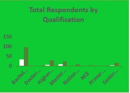

# 2023-GENERAL-ELECTION-SURVEY

## Introduction
The last 8 years have been a rollercoaster of feelings and emotions for Nigerians, in which they are helpless and hopeless due to the situation of the country, which has negatively impacted all sectors, including the economy, security, individuals, families, and businesses. The course was mostly blamed on the present administration of government, and the majority could hardly wait for the exchange of political offices from the present administration to the people they think are more competent and understand the concerns of the masses more.

The presidential election in Nigeria holds every 4 years, which is at the end of a tenure. The 2023 general election was stated to hold on the 25th of May 2023, which is why the analysis was done at the time.

## Probles Statement
The analysis was conducted to check the political willingness and readiness of Nigerians for the 2023 election exercise.

## Data Sourcing
Data was sourced by creating a Google Form containing the necessary information needed for the survey and sharing it with contacts. The link to the form was uploaded on social media, and some influencers were engaged to help in the sharing and broadcast of the form. WhatsApp also became a very useful tool for publicity. The link to the form was sent as a broadcast message to contacts that were asked to fill it out and share their status with friends, families, and acquaintances.

## Data transformation
The data was transformed using a power query in Microsoft Excel, while the analysis was done using Microsoft Excel.

## Skills demonstrated
The skills demonstrated include:
1.	Data cleaning.
2.	Replace values.
3.	Replace errors.
4.	Remove column.
5.	Table consolidation.

## Analysis and visualization
The total responses received were 238, and the analysis done was strictly based on the responses received. The visualization was done using Microsoft Excel; some insights were generated, and conclusions were derived from them.

# DASHBOARD
On this dashboard, the green colour indicates the number of people willing to vote, while the white colour represents those who are not willing to vote.

## Insights generated:
1.	**Total Respondent by Religion:** The religion cuts across Christians, Muslims, and other religions. It shows that more Christians filled out the survey form than Muslims, while no one from the other religion filled out the form

2.	**Total respondent by qualification:** This shows the qualification of the respondent that filled out the survey form. The qualifications are the Primary School Leaving Certificate, Senior Secondary School Certificate (SSCE), NCE, National Diploma (ND), Higher National Diploma (HND), Bachelor’s degree, Master’s degree, and Doctorate degree.

3.	**Total respondent per state:** the respondents cut across 23 states out of Nigeria’s 36 states, with Ogun State being the state with the highest number of respondents.

4.	**Percentage of people willing to vote:** This shows the percentage of people who picked "yes," that is, are willing to vote, compared to those who picked "no," that are not willing to vote. The analysis shows that a larger percentage of people are willing to vote compared to those who are not.

5.	**Respondents by age group:** this shows the age group of the respondent. The visualization shows that the majority of those who filled out the survey form fall between 20 and 30 years old, followed by the 21–40 age group.

6.	**Respondent by gender:** This shows that the percentage of males who filled out the form is higher than that of females.

## CONCLUSION
The analysis shows that 76% of the people that participated in the survey are willing to vote, while 24% won’t be voting due to reasons such as no Permanent Voters Card (PVC), distance to their polling unit, and personal unwillingness to vote. This is impressive and notable as the majority usually feel less concern about the election and the outcomes in the previous years.
